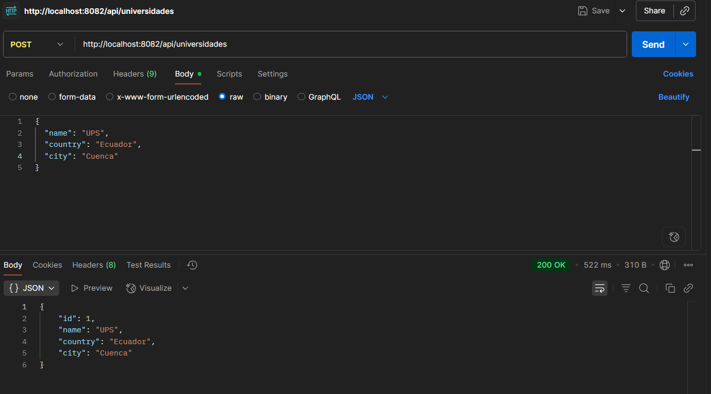
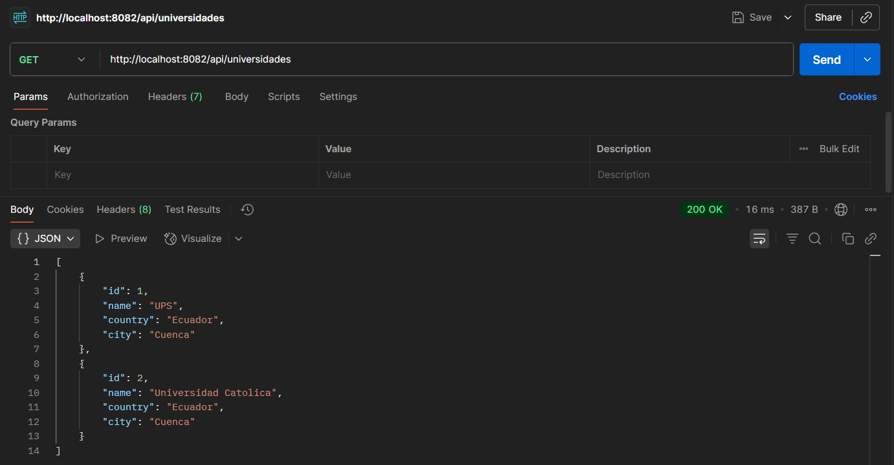
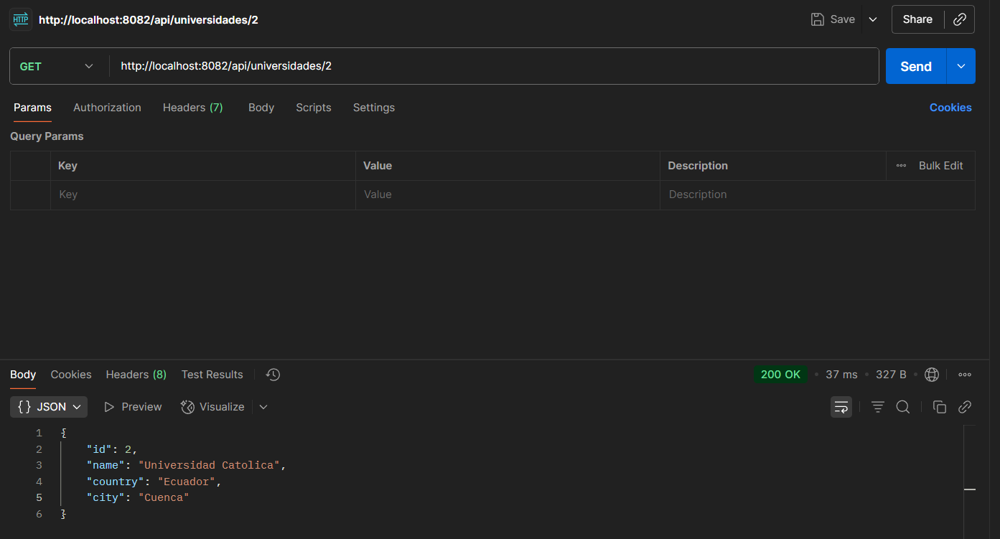
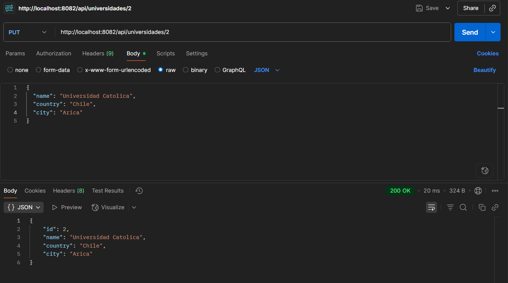
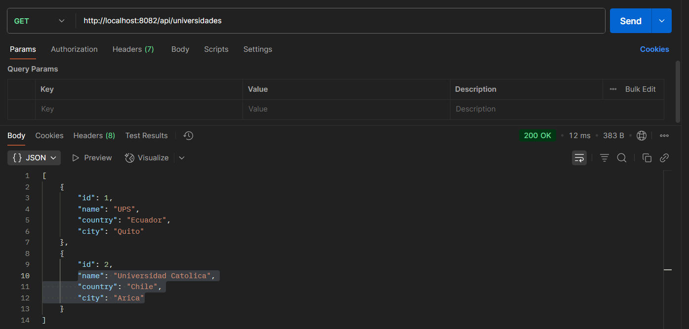
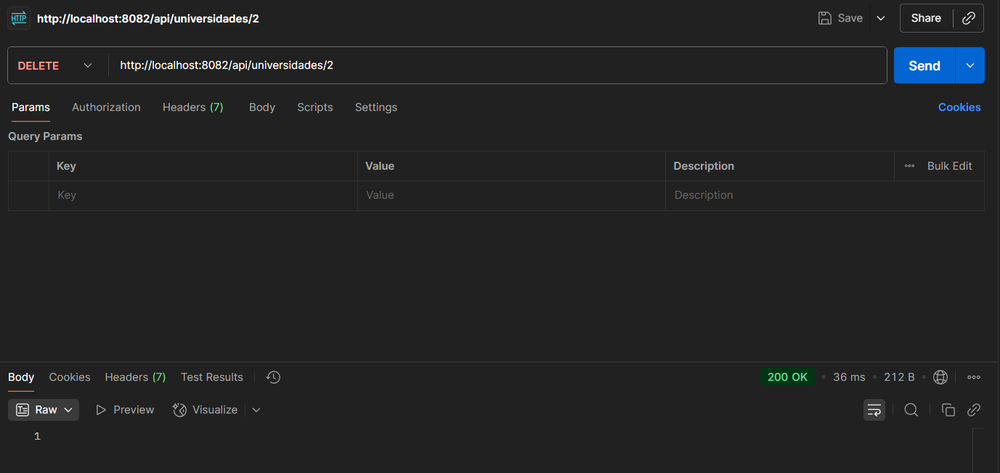
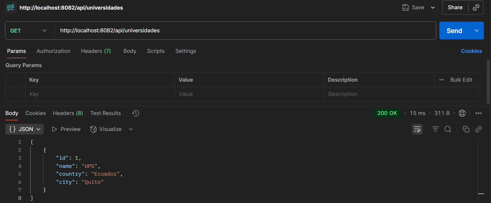

# Api-spring_boot-universidad

## api de Univeridad con sprint-boot

universidad/
├── config/
│   └── CorsConfig.java
├── universidadModel/
│   ├── ResourceNotFoundException.java
│   ├── Universidad.java
│   ├── UniversidadController.java
│   └── UniversidadRepository.java
└── UniversidadApplication.java

#   Ejecutar el proyecto

## Requisitos

tener docker instalado 

## clonar el proyecto

git clone https://github.com/patriciomerchan25/univeridad-microservcio.git
    
## crear el jar del proyecto ;

mvn clean package -DskipTests

## crear Dockerfile

Dockerfile : para la imagen del api iniversidad

## Crear Imagen con docker del api universidad 

docker build -t universidad .

## creacion de yml para Dockerización  de contenedores y tener dos servicios

Docker-compose.yml: para  orquestar los contenedores

## levanatar  contenedores en el  directorio 

 docker compose up 

## probar api con posman

Endpoints en http://localhost:8082/api/universidades

GET /    listar universidades

GET /{id}   obtener universidad por ID

POST /   crear nueva universidad

PUT /{id}   actualizar universidad existente

DELETE /{id}  eliminar universidad

# imagenes

###  Crear universidad (POST)

###  Listar todas las universidades (GET)

###  Buscar universidad por ID (GET)

###  Editar universidad (PUT)

###  Ver universidades luego de edición

###  Eliminar universidad por ID (DELETE)

###  Confirmar eliminación

